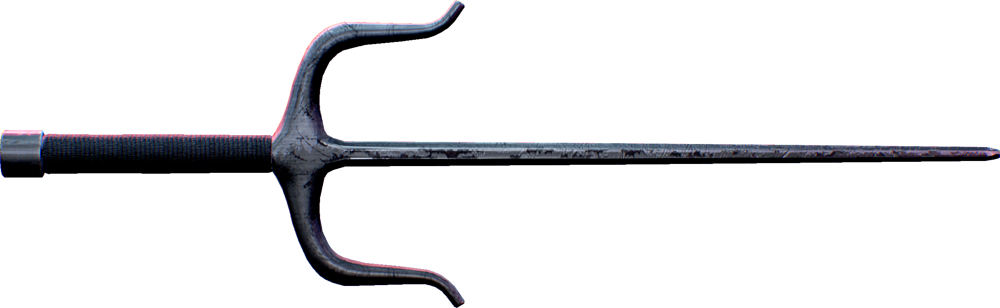

# Sai - A fork in (a) dojo



Sai is a framework for making DApps

## High level Parts

The high level parts of Sai will be:

- Core cairo library
- Off chain indexer and database
- Deployment system

### Core cairo library

The core cairo library consists of serval parts:

- Storage including interfacing with off chain
- Permissions
- Dns

### Off chain indexer and database

This allows for easy reading and reading of chain storage by off chain components. The major parts are

- Indexer
- Database populator
- Database
- External database interface

### Deployment system

This will allow for easy deployment of multi-contract dapps including setting up permissions, contract dns, and parts needed for easy off chain interfacing.

---

---

# Cairo core

## Terms

- read: reading data from store (such as chain storage).
- write: write data that can be read at a later time.
- set: Publish data in a way that is write only (such as emitting events).

## Tables and schemas

Tables are comparable to dojo Models but they are meant to be rarely used directly in code as they contain all the possible fields associated with an id including ones are are write only for off chain use.

Schemas are parts of a table that are used to directly read and write from chain and emit events. The distinction between tables and schemas allows for much more effient storage on and off chain buy only reading, writing and setting the nessasary values.

```rust
#[sia::table]
struct ATable{
    key_1: felt252,
    key_2: felt252,
    pub_value: felt252,
    write_value: felt252
    value_3: u256,
    a_struct: MyStruct,
}

#[sia::schema]
struct MySchema {
    #[key]
    key_1: felt252,
    #[key]
    key_2: felt252,
    #[sia::set]
    pub_value: felt252,
    write_value: felt252
}
```

Types of fields in a schema:

- `#[key]`: A key is publish only but the id is formulated from it, if the key or keys serialize to a single felt this will be the id otherwise the poseidon hash is used.
- `#[sia::set]`: This is used on a field that is write only
- All other fields are saved to the database

Notes:

- Users will define all the schemas they need (Not making ModelValues automatically)
- Users will be in charge of making sure all schemas match up with typing and layout (in the future there could be some compile time checking)
- Schemas with `#[sia::set]` cannot be read directly but `#[key]` can be by inputting them when reading then the read schemas can be cast.
- Schemas can either have:
  - No keys.
  - A key that serializes down to a single felt.
  - A key or keys that serializes down to multiple felts.

## High level usage

### Authors

The Authors is intended as the high level interface use by most devs when reading writing and setting data. The table selector can be

```rust
trait DatabaseAuthor<A> {
    fn read_db<K, S>(self: @A, table: felt252, keys: K) -> S;
    fn reads_db<K, S>(self: @A, table: felt252, keys: Span<K>) -> Array<S>;
    fn write_db<S>(ref self: A, table: felt252, model: S);
    fn writes_db<S>(ref self: A, table: felt252, models: Span<S>);
    fn write_keys_db<K, S>(ref self: A, table: felt252, keys: K, entity: @S);
    fn writes_keys_db<K, S>(ref self: A, table: felt252, entities: Span<(K, S)>);
}

// TODO: Define high level interface for tables and schemas to allow for easy usage
```

### Schema Traits

The schema traits are used to interface with the Authors to allow for easy reading, writing and setting

## Casting

To make schemas really powerful there need to be an easy way to cast between them. This will allow for example cases such as reading some felids then writing/setting to additional ones

Unsure of the current abilities of inline macros so there are a few ways this could be implemented.

### Ideal implementation

```rust
// when all MyStruct1 data is in MyStruct2
let struct_1: MyStruct1 = cast!(struct_2);

// When addition fields are in MyStruct 2 that MyStruct 1
let struct_2: MyStruct2 = cast!(struct_1, key_1, set_field_1);
```

### Next best

```rust
// when all MyStruct1 data is in MyStruct2
let struct_1: MyStruct1 = cast!(struct_2, MyStruct1);

// When addition fields are in MyStruct 2 that MyStruct 1
let struct_2: MyStruct2 = cast!(struct_1, MyStruct2, key_1, set_field_1);
```

## Low level interfacing

### Serialised Types

These types are used with interfaces below They can have three possible members:

- `id`: The entity id.
- `write`: Data that is to be written to a store (such as on chain storage).
- `set`: Data that is write only to be emitted to be used off chain.

```rust
#[derive(Drop, Serde)]
pub struct IdWrite {
    pub id: felt252,
    pub write: Span<felt252>
}

#[derive(Drop, Serde)]
pub struct IdSet {
    pub id: felt252,
    pub set: Span<felt252>
}

#[derive(Drop, Serde)]
pub struct SetWrite {
    pub set: Span<felt252>,
    pub write: Span<felt252>
}

#[derive(Drop, Serde)]
pub struct IdSetWrite {
    pub id: felt252,
    pub set: Span<felt252>,
    pub write: Span<felt252>
}
```

### Schema data

These are used to define schemas, for set only operations the schema selector is only needed, for write the field layouts are needed as well.

### Interfaces

These interfaces such as on contracts or to store directly to chain or emit events. Even though they are starknet interfaces they can be used inside contracts to directly store to chain or emit events.

```rust
#[starknet::interface]
pub trait IStoreSet<S> {
    fn store_set_entity(
        self: @S, table: felt252, schema_selector: felt252, id: felt252, values: Span<felt252>
    );
    fn store_set_entities(self: @S, table: felt252, schema_selector: felt252, entities: IdSet);
}

#[starknet::interface]
pub trait IStoreWrite<S> {
    fn store_write_entity(
        self: @S, table: felt252, schema: SchemaData, id: felt252, values: Span<felt252>
    );
    fn store_write_entities(self: @S, table: felt252, schema: SchemaData, entities: IdWrite);
}

#[starknet::interface]
pub trait IStoreSetWrite<S> {
    fn store_set_write_entity(
        self: @S,
        table: felt252,
        schema: SchemaData,
        id: felt252,
        set: Span<felt252>,
        write: Span<felt252>
    );
    fn store_set_write_entities(self: @S, table: felt252, schema: SchemaData, entities: IdSetWrite);
}

#[starknet::interface]
pub trait IStoreRead<S> {
    fn store_read_entity(
        self: @S, table: felt252, fields: Span<FieldLayout>, id: felt252
    ) -> Span<felt252>;
    fn store_read_entities(
        self: @S, table: felt252, fields: Span<FieldLayout>, ids: Span<felt252>
    ) -> Array<Span<felt252>>;
}
```
